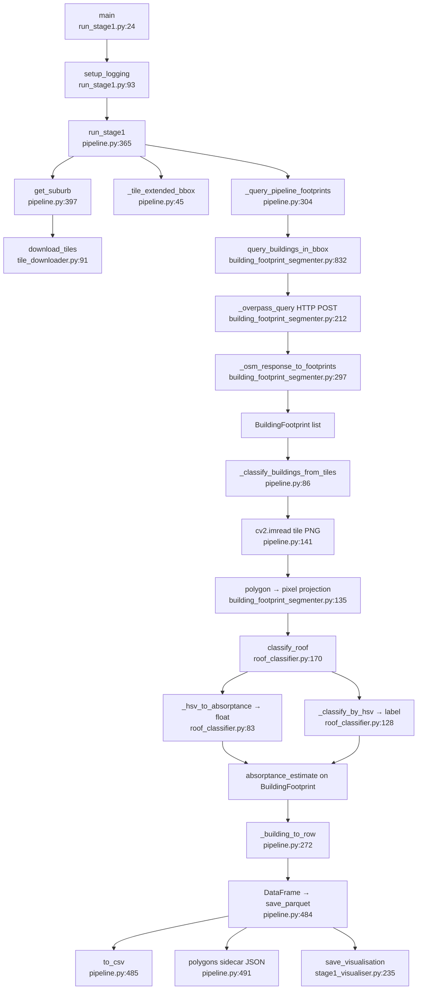

# Stage 1: Roof Segmentation — Flowchart
**Entry:** `stage1_segmentation/run_stage1.py:24`

## Happy Path

## Outputs
- `data/output/stage1_{suburb_key}.parquet`
- `data/output/stage1_{suburb_key}.csv`
- `data/output/stage1_{suburb_key}_polygons.json`
- `data/output/stage1_{suburb_key}_annotated.png`

## External deps
- Google Maps Static API (GOOGLE_MAPS_API_KEY)
- OSM Overpass API (no key)

## Key weak points
1. Dual tile centre calculations (visualiser + geo_utils can drift)
2. lon/lat vs lat/lon coordinate order flipped manually at multiple call sites
3. Confidence score semantics: 1.0 = OSM tag, 0.0–0.7 = HSV, 0.0 = unclassified — three meanings
4. absorptance_uncertainty collected but not propagated to Stage 2 calculation
