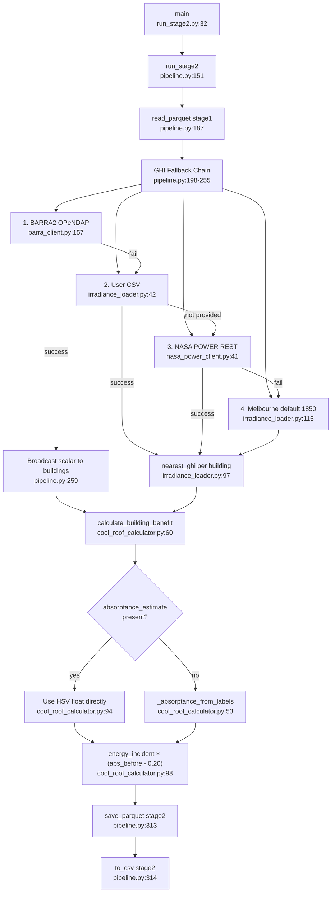

# Stage 2: Irradiance + Cool Roof Delta — Flowchart
**Entry:** `stage2_irradiance/run_stage2.py:32`

## Happy Path

## GHI Fallback Chain
BARRA2 → user CSV → NASA POWER → Melbourne constant 1850 kWh/m²/yr

## Key weak points
1. Monthly W/m² → kWh/m²/day uses factor 24 (irradiance_processor.py:57) — should be ~12 effective sun hours
2. Input CSV unit not validated — if user provides kWh/m²/day instead of /yr, silent 365× error
3. absorptance_uncertainty passed to calculator but never used in output
4. irradiance_source tag is suburb-wide, not per-building
5. NASA POWER grid density (0.1° = 11 km) not adaptive to suburb size
