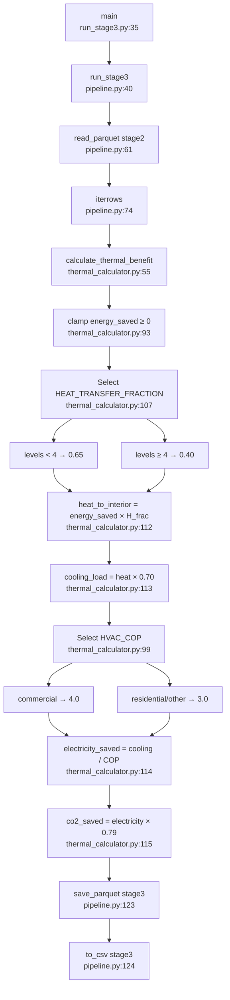

# Stage 3: Thermal Modelling — Flowchart
**Entry:** `stage3_thermal/run_stage3.py:35`

## Happy Path



## Physics Chain
```
heat_to_interior        = energy_saved × 0.65 (or 0.40 for 4+ storeys)
cooling_load_reduction  = heat_to_interior × 0.70
electricity_saved       = cooling_load / COP (3.0 or 4.0)
co2_saved               = electricity_saved × 0.79
```
Net multiplier (typical residential): 0.65 × 0.70 / 3.0 = **0.152**

## Key FYP defensibility risks
1. COOLING_FRACTION = 0.70 — vague NatHERS cite, no specific report
2. HVAC_COP ignores seasonal variation (COP drops to 2.0–2.5 at 35°C — exactly when cool roof matters most)
3. roof_material passed to calculator but never used (dead parameter)
4. No uncertainty output — reports point estimates to 1 decimal place
5. Binary building-type split too coarse — warehouse should have COP→∞ (no active cooling)
